  
  

  

  

  

<picture>
  <source media="(prefers-color-scheme: light)" srcset="https://www.gitskins.com/api/section/projects?username=abhishek1123-kr&theme=aurora&avatar=https%3A%2F%2Favatars.githubusercontent.com%2Fu%2F185959634%3Fu%3D666729b85bfb4f822be1f8c1c58806947967a69c%26v%3D4&repos=abhishek1123-kr%2FCLONE-GNUMIS-PU25%2Cabhishek1123-kr%2FAbhishek1123%2Cabhishek1123-kr%2FSTUDYHUB%2Cabhishek1123-kr%2FAbhishek1123-kr&variant=wow&v=wow-projects-1&mode=light" />
  

  

  
<!-- </picture>
| Project | What it is | Repository |
|---|---|---|
| **STUDYHUB** | Study material platform for students | [Open](https://github.com/Abhishek1123-kr/STUDYHUB) |
| **CLONE-GNUMIS-PU25** | University portal clone | [Open](https://github.com/Abhishek1123-kr/CLONE-GNUMIS-PU25) |
| **pyhtonGCF-project** | Personal chat-room project | [Open](https://github.com/Abhishek1123-kr/pyhtonGCF-project) |
| **Rakhi2025** | Raksha Bandhan themed web project | [Open](https://github.com/Abhishek1123-kr/Rakhi2025) |
| **GitHub-Achievements** | GitHub profile badge reference | [Open](https://github.com/Abhishek1123-kr/GitHub-Achievements) | -->

<a href="https://github.com/abhishek1123-kr">
<picture>
  <source media="(prefers-color-scheme: light)" srcset="https://www.gitskins.com/api/section/heatmap?username=abhishek1123-kr&theme=github-dark&avatar=https%3A%2F%2Favatars.githubusercontent.com%2Fu%2F185959634%3Fu%3D666729b85bfb4f822be1f8c1c58806947967a69c%26v%3D4&variant=space-shooter&v=space-jet-original-2&mode=light" />
  
</picture>
</a>

